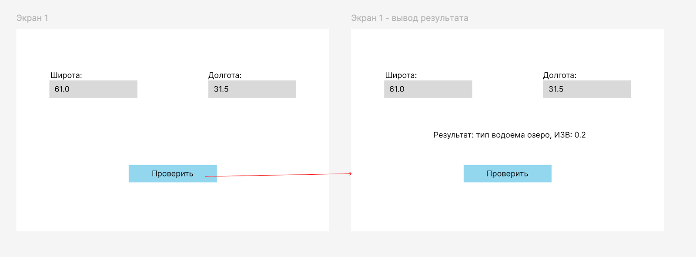

# mse1h2026-water
## О проекте
### Постановка задачи
Основная проблема:  
получение типа водоема и его экологического статуса по координатам (широта и долгота)  
Категория пользователей:  
Экологи и люди интересующиеся экологией, для которых важно получение информации о водоемах
### Требования
1. веб-страница для ввода данных
2. обязательно использовать NDWI для сегментации
3. результат один из 4 типов водоемов (озеро, река, болото, пруд) и 2 экологических статуса (ИЗВ, эвтрофикация)
4. классифицировать водоем по открытым данным и/или обученной модели

Технологии: Python, scikit-learn / TensorFlow, Google Earth Engine API, FastAPI.
### Сценарии использования
Основной сценарий использования:
1. Пользователь вводит координаты и нажимает на кнопку проверки
2. Система отображает тип и экологический статус

Макет

### Инструкция по запуску
* [северной части](https://github.com/moevm/mse1h2026-water/wiki/Endpoint-для-запроса)
* [веб-страницы](https://github.com/moevm/mse1h2026-water/wiki/UI-demo-wiki)
* [пример работы с OSM](https://github.com/moevm/mse1h2026-water/wiki/Open-Data-Integration)
* [пример работы с GEE API](https://github.com/moevm/mse1h2026-water/wiki/Использование-GEE-API)
* [модель](https://github.com/moevm/mse1h2026-water/wiki/Классификатор-типов-водоемов-с-помощью-CV) 

## Итерация №1
### Презентация
[Презентация 1](https://github.com/moevm/mse1h2026-water/blob/reports/docs/Итерация%201.pdf)
### Запланированные задачи
1. получить доступ в репозиторий и общим чатам
2. правильно указать имена на github
3. провести встречи с командой и заказчиком
4. создать шаблон для демо страницы
5. создать один endpoint для запроса
6. создать пример использования готовой модели (может не быть некоторых типов водоемов)
7. создать пример использования открытых данных (GEE API, OSM API)

### Выполненные задачи
1. получен доступ в репозиторий и общим чатам
2. указаны имена на github
3. проведена встреча с командой и заказчиком
4. создан шаблон для демо страницы [wiki](https://github.com/moevm/mse1h2026-water/wiki/UI-demo-wiki)
5. создан один endpoint для запроса [wiki](https://github.com/moevm/mse1h2026-water/wiki/Endpoint-для-запроса)
6. пример использования готовой модели [wiki](https://github.com/moevm/mse1h2026-water/wiki/Классификатор-типов-водоемов-с-помощью-CV)
7. пример использования открытых данных ([GEE API](https://github.com/moevm/mse1h2026-water/wiki/Использование-GEE-API), [OSM API](https://github.com/moevm/mse1h2026-water/wiki/Open-Data-Integration))

### Задачи на следующую итерацию
1. связать компоненты
2. улучшение работы модели

## Итерация №2
### Презентация
[Презентация 2]()
### Запланированные задачи
1. Автоматизировать запуск
2. Написать Dockerfile для front
3. Написать Dockerfile для back
4. Написать docker compose файл
5. Улучшение работы модели
6. Связать отдельные компоненты (back и front, добавить в back модель)

### Выполненные задачи
1. Автоматизирован запуск
2. Написан Dockerfile для front
3. Написан Dockerfile для back
4. Написан docker compose файл
5. Улучшена работа модели (ускорение работы, определение оптимального радиуса 6 км)
6. Связаны отдельные компоненты (back и front, модель добавлена в back)

Front - https://fairly-supportive-skimmer.cloudpub.ru/  
Api - https://ghostly-direct-gerbil.cloudpub.ru/

### Задачи на следующую итерацию
1. Написать тесты
2. улучшение работы модели распознавание болот

